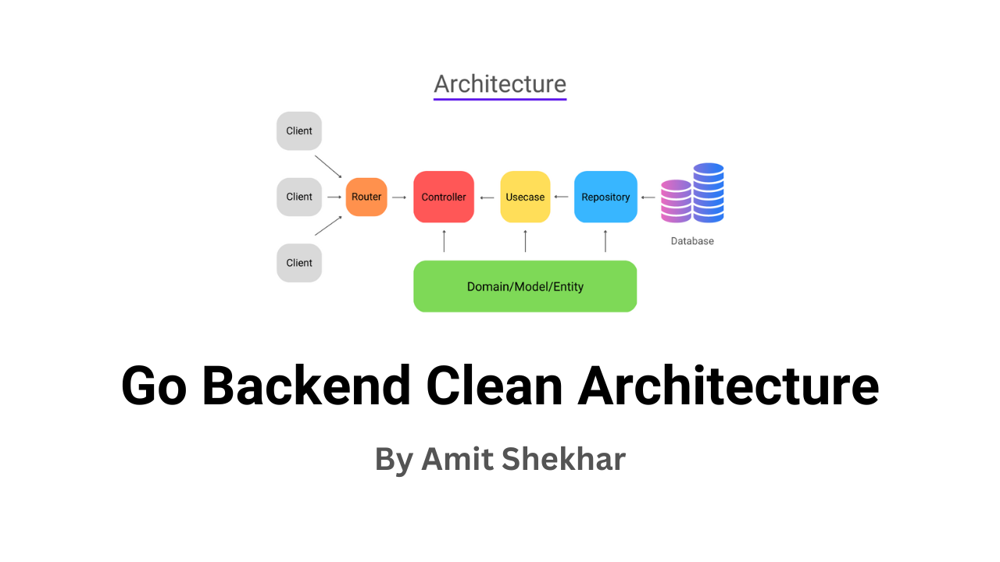
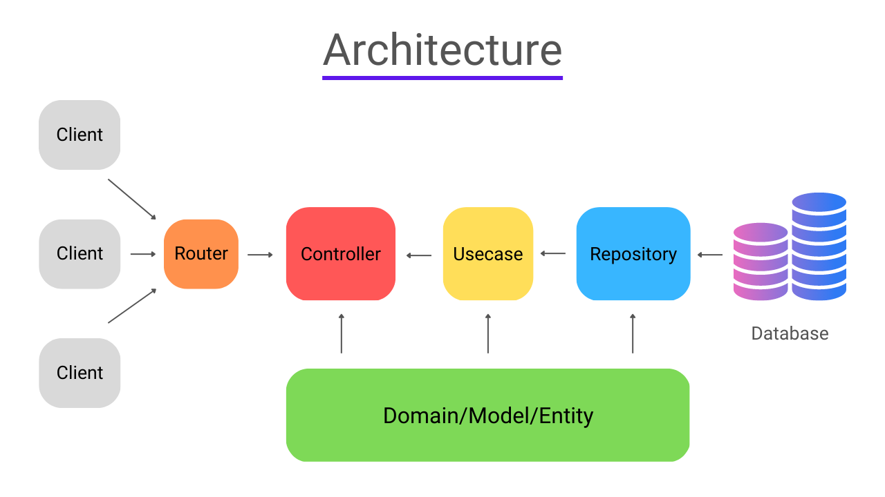
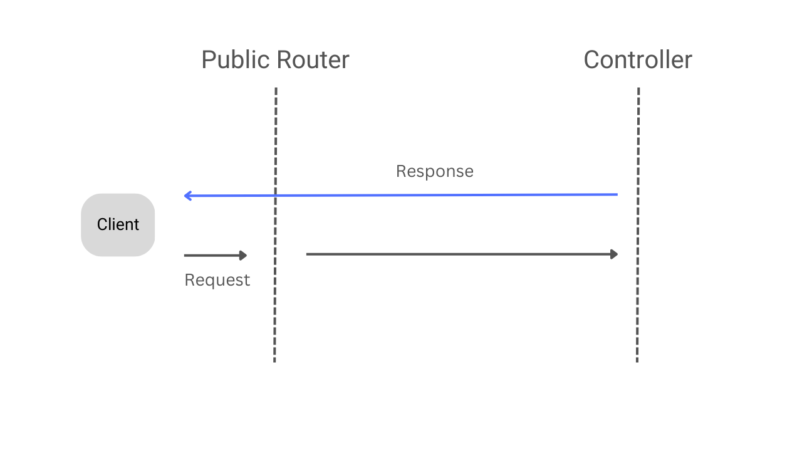
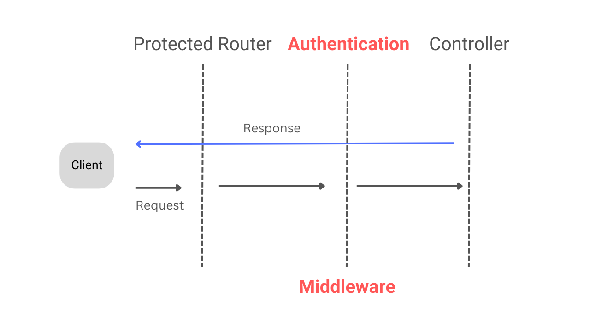

# Go Backend Clean Architecture

A Go (Golang) RESTful Backend API service built using Clean Architecture principles with Gin, MongoDB, JWT Authentication Middleware, Testify/Mockery unit testing, and Docker support.



## Overview

This project provides a robust, production-grade template for building backend services in Go. It follows Clean Architecture principles to keep code decoupled, highly maintainable, and easily testable across independent application layers.

## Architecture Layers

The application is structured into 5 decoupled layers:

- **Router:** Handles HTTP path definitions and middleware attachment.
- **Controller:** Parses incoming request payloads and formats JSON responses.
- **Usecase:** Implements core business logic independently of external frameworks or databases.
- **Repository:** Manages data persistence and database queries (MongoDB).
- **Domain:** Defines core structs, interfaces, and error/success responses.



## Major Packages Used

- **gin**: Fast HTTP web framework for routing and request handling.
- **mongo-go-driver**: Official Golang driver for MongoDB connectivity.
- **jwt**: JSON Web Token implementation for Access Token and Refresh Token security.
- **viper**: Configuration management for reading environment variables (`.env`).
- **bcrypt**: Adaptive password hashing algorithm for secure authentication.
- **testify**: Testing toolkit with assertions and mock objects.
- **mockery**: Code generator for generating interface mocks during testing.

### Public API Request Flow (No Auth)



### Private API Request Flow (With JWT Middleware)

> Includes JWT Authentication Middleware for Access Token Validation.



## How to Run This Project

### 1. Prerequisites
- Go 1.19+ installed locally.
- MongoDB running locally or a MongoDB Atlas connection string.

### 2. Setup Environment Variables
Copy `.env.example` to `.env` in the root directory:

```bash
cp .env.example .env
